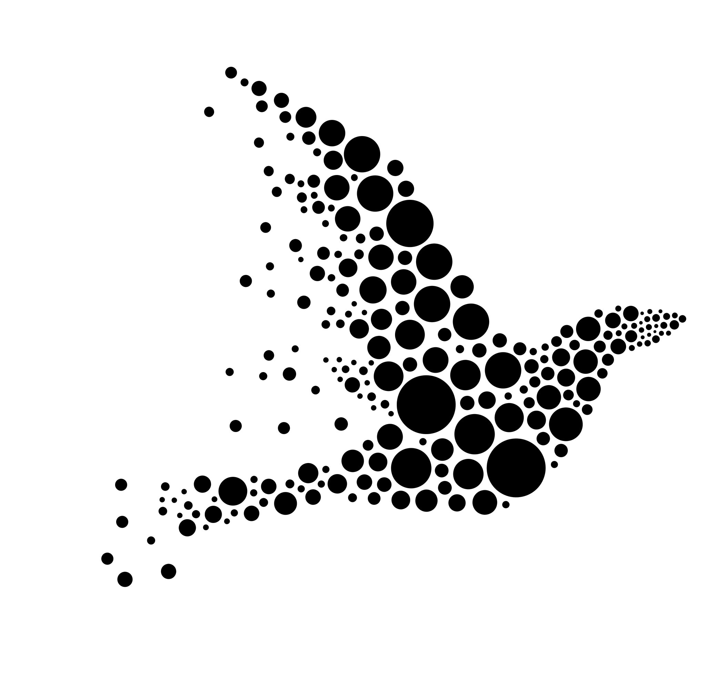

<h1 align="center">BirdNET-stream</h1>

Realtime BirdNET powered soundscape analysis for bird song identification.

    

## Acknoledgements

- [BirdNET](https://birdnet.cornell.edu) on which this project relies
- [BirdNET-Pi](https://birdnetpi.com) the great inspiration of this project
